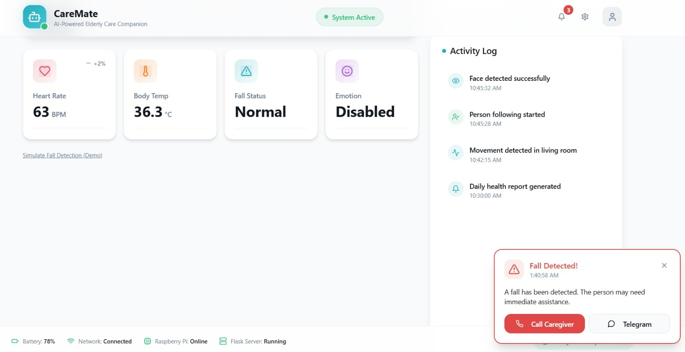

# CareMate- AI Powered Elderly Care Companion Robot

CareMate is an intelligent system designed to improve the safety and daily monitoring of elderly individuals. It combines computer vision, IoT-based health tracking, and a web interface to provide a practical and reliable smart care solution.

The project focuses on real-time assistance by detecting critical situations such as falls, monitoring health parameters, and enabling quick communication through alert systems.

## Overview

CareMate brings together multiple functionalities into a single integrated system. It continuously observes user activity, processes data in real time, and responds to emergencies through automated alerts and notifications.

## Features

- Person following system  
- Fall detection with real-time alerts  
- Health monitoring using sensors  
- Voice assistant for basic interaction  
- Web dashboard for monitoring  
- Telegram alerts for emergency notifications  

## Project Structure

caremate/
├── module_01_person_following/
├── module_02_fall_detection/
├── module_03_health_monitoring/
├── module_04_voice_assistant/
├── module_05_dashboard_alerts/
├── full_system/
├── config.py
├── README.md

## Technologies Used

- Python  
- OpenCV  
- Arduino  
- Flask  
- Telegram Bot API  

## Setup

1. Clone the repository  
2. Install dependencies
 pip install -r requirements.txt
3. Run the application  
python main.py

## Demo

### Person Following

### Fall Detection

### Dashboard & Alerts

### Telegram Alerts

### Voice Assistant

## Work Done

- Developed fall detection functionality  
- Integrated multiple modules into a single system  
- Worked on dashboard and alert mechanisms  

## Future Improvements

- Mobile application integration  
- Cloud-based monitoring  
- Improved detection accuracy  

## Notes

This project was developed as part of practical learning in AI and embedded systems, focusing on real-world problem solving.
